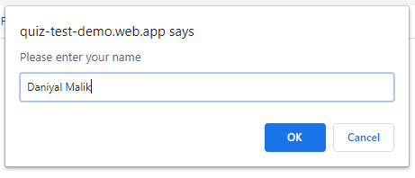
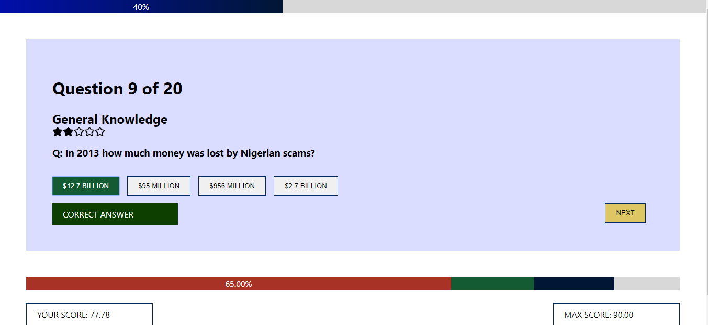

<<<<<<< HEAD
# DM 103348: Quiz App

### PROJECT MEMBERS
=======
#DM 103348: Quiz App#

###PROJECT MEMBERS###
>>>>>>> a6af5b307facbdb2a91d364ac5dc77d6812671f0
StdID | Name
----- | -------------
**64262** | **M. Daniyal Malik** <!--this is the group leader in bold-->
64254 | Riyan Shahid (Class Id: 103347)
64290 | Ubaid Ullah

<<<<<<< HEAD
## Project Description
We build Quiz App for Entertainment and Education purpose. This app contain beautiful User Interface, Experience (UI & UX) and interesting Questions.

## Discrete Math Concepts Used
We use RSA for Encryption and Decryption process as we know in this kind of app we have to use strong backend but if somehow anybody break into our backend, they will not find data in decrypted form and all there struggle become a waste of time. We applied RSA in Options and Answer so that if user hack into our Database they will not get answers of question. For demonstration we showed Your Name encryption and decryption in console you can check blow in Demo Images.

### Example 1: Replace with Your Own
=======
## Project Description ##
We build Quiz App for Entertainment and Education purpose. This app contain beautiful User Interface, Experience (UI & UX) and interesting Questions.

##Discrete Math Concepts Used ##
We use RSA for Encryption and Decryption process as we know in this kind of app we have to use strong backend but if somehow anybody break into our backend, they will not find data in decrypted form and all there struggle become a waste of time. We applied RSA in Options and Answer so that if user hack into our Database they will not get answers of question.

###Example 1: Replace with Your Own###
>>>>>>> a6af5b307facbdb2a91d364ac5dc77d6812671f0
And you may also add code samples from your project to support your description. 
``` React JS ( open-source JavaScript library for building user interface for Website ).
import React from "react"; /*Importing React JS functionality*/
import "./App.css"; /*Importing Styling*/
import Questions from "./screen/Questions"; /*Importing Our Program*/

function App() {
  return (
    <div className="App">
      <Questions />
    </div>
  );
}
export default App;/*Exporting it for User*/
```
```
// Encrypt with the public key...
var encrypt = new JSEncrypt();
encrypt.setPublicKey(pubkey);
var encrypted = encrypt.encrypt(input);

// Decrypt with the private key...
var decrypt = new JSEncrypt();
decrypt.setPrivateKey(privkey);
var uncrypted = decrypt.decrypt(encrypted);
```

<<<<<<< HEAD
## Problems Faced
How to use RSA in JavaScript

### Problem 1: Confused while coding RSA and its functionality in JavaScript ###
It was an easy task for us we can use Open-Source Library for RSA but we didn't utilized them. Instead of them we code on our own so that we can demonstrate our Project. 

## References
- [links](https://github.com/Rizwanjamal/React-Test).
- [links](https://github.com/travist/jsencrypt).

## Demo Images




## Guide
- At top shown Progress Bar.
- At bottom shown Points Table with runtime progress.
- In center Questions and options are shown.

=======
##Problems Faced##
How to use RSA in JavaScript

###Problem 1: Confused while coding RSA and its functionality in JavaScript ###
It was an easy task for us we can use Open-Source Library for RSA but we didn't utilized them. Instead of them we code on our own so that we can demonstrate our Project. 

##References##
- [links](https://github.com/Rizwanjamal/React-Test).
- [links](https://github.com/travist/jsencrypt).
>>>>>>> a6af5b307facbdb2a91d364ac5dc77d6812671f0
